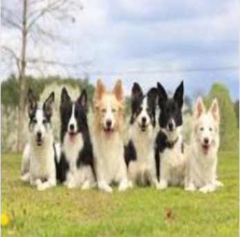
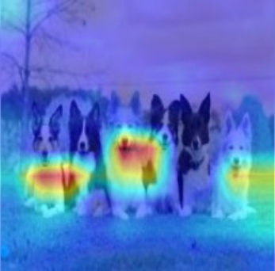
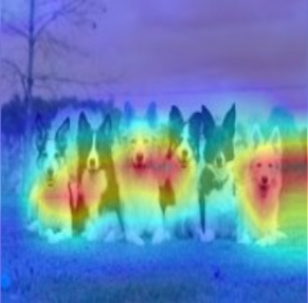
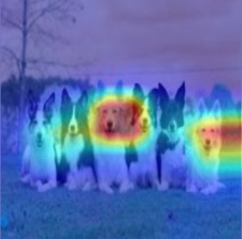
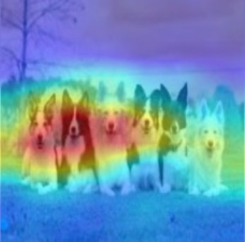
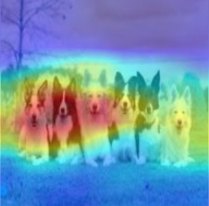

## Many Class Activation Map methods implemented in Pytorch! ##
- GradCAM
- GradCAM++
- ScoreCAM
- XGradCAM
- AblationCAM (with a fast batched implementation)

### What makes the network think the image label is 'pug, pug-dog' and 'tabby, tabby cat':
 

### Combining Grad-CAM with Guided Backpropagation for the 'pug, pug-dog' class:


----------

Tested with most of the torchvision models.
You need to choose the target layer to compute CAM for.
Some common choices can be:
- Resnet18 and 50: model.layer4[-1]
- VGG and densenet161: model.features[-1]
- mnasnet1_0: model.layers[-1]

----------

# Using from code as a library

`pip install grad-cam`

```python
from pytorch_grad_cam import GradCAM, ScoreCAM, GradCAMPlusPlus, AblationCAM, XGradCAM
from pytorch_grad_cam.utils.image import show_cam_on_image
from torchvision.models import resnet50

model = resnet50(pretrained=True)
target_layer = model.layer4[-1]
input_tensor = # Create an input tensor image for your model..

#Can be GradCAM, ScoreCAM, GradCAMPlusPlus, AblationCAM, XGradCAM
cam = GradCAM(model=model, target_layer=target_layer, use_cuda=args.use_cuda)
grayscale_cam = cam(input_tensor=input_tensor, target_category=1)
visualization = show_cam_on_image(rgb_img, grayscale_cam)
```

----------

# Running the example script:

Usage: `python cam.py --image-path <path_to_image> --method <method>`

To use with CUDA:
`python cam.py --image-path <path_to_image> --use-cuda`

----------

You can choose between:
- `GradCAM`
- `ScoreCAM`
- `GradCAMPlusPlus`
- `AblationCAM`
- `XGradCAM`

Some methods like ScoreCAM and AblationCAM require a large number of forward passes,
and have a batched implementation.

You can control the batch size with
`cam.batch_size = `

It seems that GradCAM++ is almost the same as GradCAM, in
most networks except VGG where the advantage is larger.

| Network  | Image | GradCAM  |  GradCAM++ |  Score-CAM | 
| ---------|-------|----------|------------|------------|
| VGG16    |  |      |     |   |
| Resnet50 |  |   |  |     |


----------

# References

https://arxiv.org/abs/1610.02391
`Grad-CAM: Visual Explanations from Deep Networks via Gradient-based Localization
Ramprasaath R. Selvaraju, Michael Cogswell, Abhishek Das, Ramakrishna Vedantam, Devi Parikh, Dhruv Batra`

https://arxiv.org/abs/1710.11063
`Grad-CAM++: Improved Visual Explanations for Deep Convolutional Networks
Aditya Chattopadhyay, Anirban Sarkar, Prantik Howlader, Vineeth N Balasubramanian`

https://arxiv.org/abs/1910.01279
`Score-CAM: Score-Weighted Visual Explanations for Convolutional Neural Networks
Haofan Wang, Zifan Wang, Mengnan Du, Fan Yang, Zijian Zhang, Sirui Ding, Piotr Mardziel, Xia Hu`

https://ieeexplore.ieee.org/abstract/document/9093360/
`Saurabh Desai and Harish G Ramaswamy. Ablation-cam: Visual explanations for deep
convolutional network via gradient-free localization. In WACV, pages 972–980, 2020`

https://arxiv.org/abs/2008.02312
`Axiom-based Grad-CAM: Towards Accurate Visualization and Explanation of CNNs
Ruigang Fu, Qingyong Hu, Xiaohu Dong, Yulan Guo, Yinghui Gao, Biao Li`