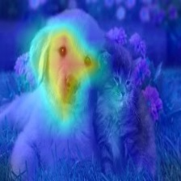
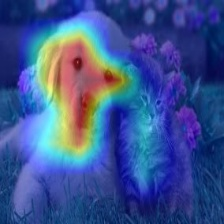
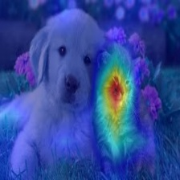

[](https://opensource.org/licenses/MIT)

[](https://pepy.tech/project/grad-cam)
[](https://pepy.tech/project/grad-cam)

# Advanced AI explainability for PyTorch

`pip install grad-cam`

Documentation with advanced tutorials: [https://jacobgil.github.io/pytorch-gradcam-book](https://jacobgil.github.io/pytorch-gradcam-book)


This is a package with state of the art methods for Explainable AI for computer vision.
This can be used for diagnosing model predictions, either in production or while
developing models.
The aim is also to serve as a benchmark of algorithms and metrics for research of new explainability methods.

⭐ Comprehensive collection of Pixel Attribution methods for Computer Vision.

⭐ Tested on many Common CNN Networks and Vision Transformers.

⭐ Advanced use cases: Works with Classification, Object Detection, Semantic Segmentation, Embedding-similarity and more.

⭐ Includes smoothing methods to make the CAMs look nice.

⭐ High performance: full support for batches of images in all methods.

⭐ Includes metrics for checking if you can trust the explanations, and tuning them for best performance.


| Method              | What it does                                                                                                                |
|---------------------|-----------------------------------------------------------------------------------------------------------------------------|
| GradCAM             | Weight the 2D activations by the average gradient                                                                           |
| HiResCAM            | Like GradCAM but element-wise multiply the activations with the gradients; provably guaranteed faithfulness for certain models |
| GradCAMElementWise  | Like GradCAM but element-wise multiply the activations with the gradients then apply a ReLU operation before summing        |
| GradCAM++           | Like GradCAM but uses second order gradients                                                                                |
| XGradCAM            | Like GradCAM but scale the gradients by the normalized activations                                                          |
| AblationCAM         | Zero out activations and measure how the output drops (this repository includes a fast batched implementation)              |
| ScoreCAM            | Perbutate the image by the scaled activations and measure how the output drops                                              |
| EigenCAM            | Takes the first principle component of the 2D Activations (no class discrimination, but seems to give great results)        |
| EigenGradCAM        | Like EigenCAM but with class discrimination: First principle component of Activations*Grad. Looks like GradCAM, but cleaner |
| LayerCAM            | Spatially weight the activations by positive gradients. Works better especially in lower layers                             |
| FullGrad            | Computes the gradients of the biases from all over the network, and then sums them                                          |
| Deep Feature Factorizations           | Non Negative Matrix Factorization on the 2D activations                                                   |
|  KPCA-CAM           | Like EigenCAM but with Kernel PCA instead of PCA
## Visual Examples

| What makes the network think the image label is 'pug, pug-dog' | What makes the network think the image label is 'tabby, tabby cat' | Combining Grad-CAM with Guided Backpropagation for the 'pug, pug-dog' class |
| ---------------------------------------------------------------|--------------------|-----------------------------------------------------------------------------|
  |  |  |

## Object Detection and Semantic Segmentation
| Object Detection | Semantic Segmentation |
| -----------------|-----------------------|
|  |  |

| 3D Medical Semantic Segmentation |
| -------------------------- |
| |

## Explaining similarity to other images / embeddings


## Deep Feature Factorization


## CLIP
| Explaining the text prompt "a dog" | Explaining the text prompt "a cat" |
| -----------------------------------|------------------------------------|
  |  |

## Classification

#### Resnet50:
| Category  | Image | GradCAM  |  AblationCAM |  ScoreCAM |
| ---------|-------|----------|------------|------------|
| Dog    |  |      |     |   |
| Cat    |  |      |     |   |

#### Vision Transfomer (Deit Tiny):
| Category  | Image | GradCAM  |  AblationCAM |  ScoreCAM |
| ---------|-------|----------|------------|------------|
| Dog    |  |      |     |   |
| Cat    |  |      |     |   |

#### Swin Transfomer (Tiny window:7 patch:4 input-size:224):
| Category  | Image | GradCAM  |  AblationCAM |  ScoreCAM |
| ---------|-------|----------|------------|------------|
| Dog    |  |      |     |   |
| Cat    |  |      |     |   |


# Metrics and Evaluation for XAI


----------

# Usage examples

```python
from pytorch_grad_cam import GradCAM, HiResCAM, ScoreCAM, GradCAMPlusPlus, AblationCAM, XGradCAM, EigenCAM, FullGrad
from pytorch_grad_cam.utils.model_targets import ClassifierOutputTarget
from pytorch_grad_cam.utils.image import show_cam_on_image
from torchvision.models import resnet50

model = resnet50(pretrained=True)
target_layers = [model.layer4[-1]]
input_tensor = # Create an input tensor image for your model..
# Note: input_tensor can be a batch tensor with several images!

# We have to specify the target we want to generate the CAM for.
targets = [ClassifierOutputTarget(281)]

# Construct the CAM object once, and then re-use it on many images.
with GradCAM(model=model, target_layers=target_layers) as cam:
  # You can also pass aug_smooth=True and eigen_smooth=True, to apply smoothing.
  grayscale_cam = cam(input_tensor=input_tensor, targets=targets)
  # In this example grayscale_cam has only one image in the batch:
  grayscale_cam = grayscale_cam[0, :]
  visualization = show_cam_on_image(rgb_img, grayscale_cam, use_rgb=True)
  # You can also get the model outputs without having to redo inference
  model_outputs = cam.outputs
```

[cam.py](https://github.com/jacobgil/pytorch-grad-cam/blob/master/cam.py) has a more detailed usage example.

----------
# Choosing the layer(s) to extract activations from
You need to choose the target layer to compute the CAM for.
Some common choices are:
- FasterRCNN: model.backbone
- Resnet18 and 50: model.layer4[-1]
- VGG, densenet161 and mobilenet: model.features[-1]
- mnasnet1_0: model.layers[-1]
- ViT: model.blocks[-1].norm1
- SwinT: model.layers[-1].blocks[-1].norm1


If you pass a list with several layers, the CAM will be averaged accross them.
This can be useful if you're not sure what layer will perform best.

----------

# Adapting for new architectures and tasks

Methods like GradCAM were designed for and were originally mostly applied on classification models, 
and specifically CNN classification models.
However you can also use this package on new architectures like Vision Transformers, and on non classification tasks like Object Detection or Semantic Segmentation.

The be able to adapt to non standard cases, we have two concepts.
- The reshape transform - how do we convert activations to represent spatial images ?
- The model targets - What exactly should the explainability method try to explain ?

## The reshape_transform argument
In a CNN the intermediate activations in the model are a mult-channel image that have the dimensions channel x rows x cols,
and the various explainabiltiy methods work with these to produce a new image.

In case of another architecture, like the Vision Transformer, the shape might be different, like (rows x cols + 1) x channels, or something else.
The reshape transform converts the activations back into a multi-channel image, for example by removing the class token in a vision transformer. 
For examples, check [here](https://github.com/jacobgil/pytorch-grad-cam/blob/master/pytorch_grad_cam/utils/reshape_transforms.py)

## The model_target argument
The model target is just a callable that is able to get the model output, and filter it out for the specific scalar output we want to explain.

For classification tasks, the model target will typically be the output from a specific category.
The `targets` parameter passed to the CAM method can then use `ClassifierOutputTarget`:
```python
targets = [ClassifierOutputTarget(281)]
```

However for more advanced cases, you might want a different behaviour.
Check [here](https://github.com/jacobgil/pytorch-grad-cam/blob/master/pytorch_grad_cam/utils/model_targets.py) for more examples.

----------

# Tutorials
Here you can find detailed examples of how to use this for various custom use cases like object detection:

These point to the new documentation jupter-book for fast rendering.
The jupyter notebooks themselves can be found under the tutorials folder in the git repository.

- [Notebook tutorial: XAI Recipes for the HuggingFace 🤗 Image Classification Models](<https://jacobgil.github.io/pytorch-gradcam-book/HuggingFace.html>)

- [Notebook tutorial: Deep Feature Factorizations for better model explainability](<https://jacobgil.github.io/pytorch-gradcam-book/Deep%20Feature%20Factorizations.html>)

- [Notebook tutorial: Class Activation Maps for Object Detection with Faster-RCNN](<https://jacobgil.github.io/pytorch-gradcam-book/Class%20Activation%20Maps%20for%20Object%20Detection%20With%20Faster%20RCNN.html>)

- [Notebook tutorial: Class Activation Maps for YOLO5](<https://jacobgil.github.io/pytorch-gradcam-book/EigenCAM%20for%20YOLO5.html>)

- [Notebook tutorial: Class Activation Maps for Semantic Segmentation](<https://jacobgil.github.io/pytorch-gradcam-book/Class%20Activation%20Maps%20for%20Semantic%20Segmentation.html>)

- [Notebook tutorial: Adapting pixel attribution methods for embedding outputs from models](<https://jacobgil.github.io/pytorch-gradcam-book/Pixel%20Attribution%20for%20embeddings.html>)

- [Notebook tutorial: May the best explanation win. CAM Metrics and Tuning](<https://jacobgil.github.io/pytorch-gradcam-book/CAM%20Metrics%20And%20Tuning%20Tutorial.html>)

- [How it works with Vision/SwinT transformers](tutorials/vision_transformers.md)


----------

# Guided backpropagation

```python
from pytorch_grad_cam import GuidedBackpropReLUModel
from pytorch_grad_cam.utils.image import (
    show_cam_on_image, deprocess_image, preprocess_image
)
gb_model = GuidedBackpropReLUModel(model=model, device=model.device())
gb = gb_model(input_tensor, target_category=None)

cam_mask = cv2.merge([grayscale_cam, grayscale_cam, grayscale_cam])
cam_gb = deprocess_image(cam_mask * gb)
result = deprocess_image(gb)
```

----------

# Metrics and evaluating the explanations

```python
from pytorch_grad_cam.utils.model_targets import ClassifierOutputSoftmaxTarget
from pytorch_grad_cam.metrics.cam_mult_image import CamMultImageConfidenceChange
# Create the metric target, often the confidence drop in a score of some category
metric_target = ClassifierOutputSoftmaxTarget(281)
scores, batch_visualizations = CamMultImageConfidenceChange()(input_tensor, 
  inverse_cams, targets, model, return_visualization=True)
visualization = deprocess_image(batch_visualizations[0, :])

# State of the art metric: Remove and Debias
from pytorch_grad_cam.metrics.road import ROADMostRelevantFirst, ROADLeastRelevantFirst
cam_metric = ROADMostRelevantFirst(percentile=75)
scores, perturbation_visualizations = cam_metric(input_tensor, 
  grayscale_cams, targets, model, return_visualization=True)

# You can also average across different percentiles, and combine
# (LeastRelevantFirst - MostRelevantFirst) / 2
from pytorch_grad_cam.metrics.road import ROADMostRelevantFirstAverage,
                                          ROADLeastRelevantFirstAverage,
                                          ROADCombined
cam_metric = ROADCombined(percentiles=[20, 40, 60, 80])
scores = cam_metric(input_tensor, grayscale_cams, targets, model)
```


# Smoothing to get nice looking CAMs

To reduce noise in the CAMs, and make it fit better on the objects,
two smoothing methods are supported:

- `aug_smooth=True`

  Test time augmentation: increases the run time by x6.

  Applies a combination of horizontal flips, and mutiplying the image
  by [1.0, 1.1, 0.9].

  This has the effect of better centering the CAM around the objects.


- `eigen_smooth=True`

  First principle component of `activations*weights`

  This has the effect of removing a lot of noise.


|AblationCAM | aug smooth | eigen smooth | aug+eigen smooth|
|------------|------------|--------------|--------------------|
 |  |  |  | 

----------

# Running the example script:

Usage: `python cam.py --image-path <path_to_image> --method <method> --output-dir <output_dir_path> `


To use with a specific device, like cpu, cuda, cuda:0 or mps:
`python cam.py --image-path <path_to_image> --device cuda  --output-dir <output_dir_path> `

----------

You can choose between:

`GradCAM` , `HiResCAM`, `ScoreCAM`, `GradCAMPlusPlus`, `AblationCAM`, `XGradCAM` , `LayerCAM`, `FullGrad` and `EigenCAM`.

Some methods like ScoreCAM and AblationCAM require a large number of forward passes,
and have a batched implementation.

You can control the batch size with
`cam.batch_size = `

----------

## Citation
If you use this for research, please cite. Here is an example BibTeX entry:

```
@misc{jacobgilpytorchcam,
  title={PyTorch library for CAM methods},
  author={Jacob Gildenblat and contributors},
  year={2021},
  publisher={GitHub},
  howpublished={\url{https://github.com/jacobgil/pytorch-grad-cam}},
}
```

----------

# References
https://arxiv.org/abs/1610.02391 <br>
`Grad-CAM: Visual Explanations from Deep Networks via Gradient-based Localization
Ramprasaath R. Selvaraju, Michael Cogswell, Abhishek Das, Ramakrishna Vedantam, Devi Parikh, Dhruv Batra`

https://arxiv.org/abs/2011.08891 <br>
`Use HiResCAM instead of Grad-CAM for faithful explanations of convolutional neural networks
Rachel L. Draelos, Lawrence Carin`

https://arxiv.org/abs/1710.11063 <br>
`Grad-CAM++: Improved Visual Explanations for Deep Convolutional Networks
Aditya Chattopadhyay, Anirban Sarkar, Prantik Howlader, Vineeth N Balasubramanian`

https://arxiv.org/abs/1910.01279 <br>
`Score-CAM: Score-Weighted Visual Explanations for Convolutional Neural Networks
Haofan Wang, Zifan Wang, Mengnan Du, Fan Yang, Zijian Zhang, Sirui Ding, Piotr Mardziel, Xia Hu`

https://ieeexplore.ieee.org/abstract/document/9093360/ <br>
`Ablation-cam: Visual explanations for deep convolutional network via gradient-free localization.
Saurabh Desai and Harish G Ramaswamy. In WACV, pages 972–980, 2020`

https://arxiv.org/abs/2008.02312 <br>
`Axiom-based Grad-CAM: Towards Accurate Visualization and Explanation of CNNs
Ruigang Fu, Qingyong Hu, Xiaohu Dong, Yulan Guo, Yinghui Gao, Biao Li`

https://arxiv.org/abs/2008.00299 <br>
`Eigen-CAM: Class Activation Map using Principal Components
Mohammed Bany Muhammad, Mohammed Yeasin`

http://mftp.mmcheng.net/Papers/21TIP_LayerCAM.pdf <br>
`LayerCAM: Exploring Hierarchical Class Activation Maps for Localization
Peng-Tao Jiang; Chang-Bin Zhang; Qibin Hou; Ming-Ming Cheng; Yunchao Wei`

https://arxiv.org/abs/1905.00780 <br>
`Full-Gradient Representation for Neural Network Visualization
Suraj Srinivas, Francois Fleuret`

https://arxiv.org/abs/1806.10206 <br>
`Deep Feature Factorization For Concept Discovery
Edo Collins, Radhakrishna Achanta, Sabine Süsstrunk`

https://arxiv.org/abs/2410.00267 <br>
`KPCA-CAM: Visual Explainability of Deep Computer Vision Models using Kernel PCA
Sachin Karmani, Thanushon Sivakaran, Gaurav Prasad, Mehmet Ali, Wenbo Yang, Sheyang Tang`
