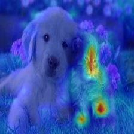
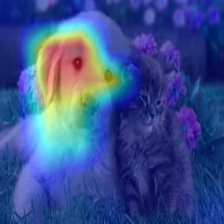

[](https://opensource.org/licenses/MIT)

[](https://pepy.tech/project/grad-cam)
[](https://pepy.tech/project/grad-cam)

# Class Activation Map methods implemented in Pytorch

`pip install grad-cam`

⭐ Comprehensive collection of Pixel Attribution methods for Computer Vision.

⭐ Tested on many Common CNN Networks and Vision Transformers.

⭐ Includes smoothing methods to make the CAMs look nice.

⭐ Full support for batches of images in all methods.


| Method   | What it does |
|----------|--------------|
| GradCAM  | Weight the 2D activations by the average gradient |
| GradCAM++  | Like GradCAM but uses second order gradients |
| XGradCAM  | Like GradCAM but scale the gradients by the normalized activations |
| AblationCAM  | Zero out activations and measure how the output drops (this repository includes a fast batched implementation) |
| ScoreCAM  | Perbutate the image by the scaled activations and measure how the output drops |
| EigenCAM  | Takes the first principle component of the 2D Activations (no class discrimination, but seems to give great results)|
| EigenGradCAM  | Like EigenCAM but with class discrimination: First principle component of Activations*Grad. Looks like GradCAM, but cleaner|
| LayerCAM  | Spatially weight the activations by positive gradients. Works better especially in lower layers |
| FullGrad  | Computes the gradients of the biases from all over the network, and then sums them |


### What makes the network think the image label is 'pug, pug-dog' and 'tabby, tabby cat':
 

### Combining Grad-CAM with Guided Backpropagation for the 'pug, pug-dog' class:


# More Visual Examples

#### Resnet50:
| Category  | Image | GradCAM  |  AblationCAM |  ScoreCAM |
| ---------|-------|----------|------------|------------|
| Dog    |  |      |     |   |
| Cat    |  |      |     |   |

#### Vision Transfomer (Deit Tiny):
| Category  | Image | GradCAM  |  AblationCAM |  ScoreCAM |
| ---------|-------|----------|------------|------------|
| Dog    |  |      |     |   |
| Cat    |  |      |     |   |

#### Swin Transfomer (Tiny window:7 patch:4 input-size:224):
| Category  | Image | GradCAM  |  AblationCAM |  ScoreCAM |
| ---------|-------|----------|------------|------------|
| Dog    |  |      |     |   |
| Cat    |  |      |     |   |

It seems that GradCAM++ is almost the same as GradCAM, in
most networks except VGG where the advantage is larger.

| Network  | Image | GradCAM  |  GradCAM++ |  Score-CAM |  Ablation-CAM |  Eigen-CAM |
| ---------|-------|----------|------------|------------|---------------|------------|
| VGG16    |  | |  |  |   |  |
| Resnet50    |  | |  |  |  |    |


----------
# Chosing the Target Layer
You need to choose the target layer to compute CAM for.
Some common choices are:
- Resnet18 and 50: model.layer4[-1]
- VGG and densenet161: model.features[-1]
- mnasnet1_0: model.layers[-1]
- ViT: model.blocks[-1].norm1
- SwinT: model.layers[-1].blocks[-1].norm1

----------

# Using from code as a library

```python
from pytorch_grad_cam import GradCAM, ScoreCAM, GradCAMPlusPlus, AblationCAM, XGradCAM, EigenCAM
from pytorch_grad_cam.utils.image import show_cam_on_image
from torchvision.models import resnet50

model = resnet50(pretrained=True)
target_layers = [model.layer4[-1]]
input_tensor = # Create an input tensor image for your model..
# Note: input_tensor can be a batch tensor with several images!

# Construct the CAM object once, and then re-use it on many images:
cam = GradCAM(model=model, target_layers=target_layers, use_cuda=args.use_cuda)

# You can also use it within a with statement, to make sure it is freed,
# In case you need to re-create it inside an outer loop:
# with GradCAM(model=model, target_layers=target_layers, use_cuda=args.use_cuda) as cam:
#   ...

# If target_category is None, the highest scoring category
# will be used for every image in the batch.
# target_category can also be an integer, or a list of different integers
# for every image in the batch.
target_category = 281

# You can also pass aug_smooth=True and eigen_smooth=True, to apply smoothing.
grayscale_cam = cam(input_tensor=input_tensor, target_category=target_category)

# In this example grayscale_cam has only one image in the batch:
grayscale_cam = grayscale_cam[0, :]
visualization = show_cam_on_image(rgb_img, grayscale_cam, use_rgb=True)
```

----------

# Smoothing to get nice looking CAMs

To reduce noise in the CAMs, and make it fit better on the objects,
two smoothing methods are supported:

- `aug_smooth=True`

  Test time augmentation: increases the run time by x6.

  Applies a combination of horizontal flips, and mutiplying the image
  by [1.0, 1.1, 0.9].

  This has the effect of better centering the CAM around the objects.


- `eigen_smooth=True`

  First principle component of `activations*weights`

  This has the effect of removing a lot of noise.


|AblationCAM | aug smooth | eigen smooth | aug+eigen smooth|
|------------|------------|--------------|--------------------|
 |  |  |  | 

----------

# Running the example script:

Usage: `python cam.py --image-path <path_to_image> --method <method>`

To use with CUDA:
`python cam.py --image-path <path_to_image> --use-cuda`

----------

You can choose between:

`GradCAM` , `ScoreCAM`, `GradCAMPlusPlus`, `AblationCAM`, `XGradCAM` , `LayerCAM` and `EigenCAM`.

Some methods like ScoreCAM and AblationCAM require a large number of forward passes,
and have a batched implementation.

You can control the batch size with
`cam.batch_size = `

----------

# How does it work with Vision Transformers

*See [usage_examples/vit_example.py](./usage_examples/vit_example.py)*

In ViT the output of the layers are typically BATCH x 197 x 192.
In the dimension with 197, the first element represents the class token, and the rest represent the 14x14 patches in the image.
We can treat the last 196 elements as a 14x14 spatial image, with 192 channels.

To reshape the activations and gradients to 2D spatial images,
we can pass the CAM constructor a reshape_transform function.

This can also be a starting point for other architectures that will come in the future.

```python

GradCAM(model=model, target_layers=target_layers, reshape_transform=reshape_transform)

def reshape_transform(tensor, height=14, width=14):
    result = tensor[:, 1 :  , :].reshape(tensor.size(0),
        height, width, tensor.size(2))

    # Bring the channels to the first dimension,
    # like in CNNs.
    result = result.transpose(2, 3).transpose(1, 2)
    return result
```

### Which target_layer should we chose for Vision Transformers?

Since the final classification is done on the class token computed in the last attention block,
the output will not be affected by the 14x14 channels in the last layer.
The gradient of the output with respect to them, will be 0!

We should chose any layer before the final attention block, for example:
```python
target_layers = [model.blocks[-1].norm1]
```

----------

# How does it work with Swin Transformers

*See [usage_examples/swinT_example.py](./usage_examples/swinT_example.py)*

In Swin transformer base the output of the layers are typically BATCH x 49 x 1024.
We can treat the last 49 elements as a 7x7 spatial image, with 1024 channels.

To reshape the activations and gradients to 2D spatial images,
we can pass the CAM constructor a reshape_transform function.

This can also be a starting point for other architectures that will come in the future.

```python

GradCAM(model=model, target_layers=target_layers, reshape_transform=reshape_transform)

def reshape_transform(tensor, height=7, width=7):
    result = tensor.reshape(tensor.size(0),
        height, width, tensor.size(2))

    # Bring the channels to the first dimension,
    # like in CNNs.
    result = result.transpose(2, 3).transpose(1, 2)
    return result
```

### Which target_layer should we chose for Swin Transformers?

Since the swin transformer is different from ViT, it does not contains `cls_token` as present in ViT,
therefore we will use all the 7x7 images we get from the last block of the last layer.

We should chose any layer before the final attention block, for example:
```python
target_layers = [model.layers[-1].blocks[-1].norm1]
```

----------

## Citation
If you use this for research, please cite. Here is an example BibTeX entry:

```
@misc{jacobgilpytorchcam,
  title={PyTorch library for CAM methods},
  author={Jacob Gildenblat and contributors},
  year={2021},
  publisher={GitHub},
  howpublished={\url{https://github.com/jacobgil/pytorch-grad-cam}},
}
```

----------

# References
https://arxiv.org/abs/1610.02391 <br>
`Grad-CAM: Visual Explanations from Deep Networks via Gradient-based Localization
Ramprasaath R. Selvaraju, Michael Cogswell, Abhishek Das, Ramakrishna Vedantam, Devi Parikh, Dhruv Batra`

https://arxiv.org/abs/1710.11063 <br>
`Grad-CAM++: Improved Visual Explanations for Deep Convolutional Networks
Aditya Chattopadhyay, Anirban Sarkar, Prantik Howlader, Vineeth N Balasubramanian`

https://arxiv.org/abs/1910.01279 <br>
`Score-CAM: Score-Weighted Visual Explanations for Convolutional Neural Networks
Haofan Wang, Zifan Wang, Mengnan Du, Fan Yang, Zijian Zhang, Sirui Ding, Piotr Mardziel, Xia Hu`

https://ieeexplore.ieee.org/abstract/document/9093360/ <br>
`Ablation-cam: Visual explanations for deep convolutional network via gradient-free localization.
Saurabh Desai and Harish G Ramaswamy. In WACV, pages 972–980, 2020`

https://arxiv.org/abs/2008.02312 <br>
`Axiom-based Grad-CAM: Towards Accurate Visualization and Explanation of CNNs
Ruigang Fu, Qingyong Hu, Xiaohu Dong, Yulan Guo, Yinghui Gao, Biao Li`

https://arxiv.org/abs/2008.00299 <br>
`Eigen-CAM: Class Activation Map using Principal Components
Mohammed Bany Muhammad, Mohammed Yeasin`

http://mftp.mmcheng.net/Papers/21TIP_LayerCAM.pdf <br>
`LayerCAM: Exploring Hierarchical Class Activation Maps for Localization
Peng-Tao Jiang; Chang-Bin Zhang; Qibin Hou; Ming-Ming Cheng; Yunchao Wei`

https://arxiv.org/abs/1905.00780 <br>
`Full-Gradient Representation for Neural Network Visualization
Suraj Srinivas, Francois Fleuret`
