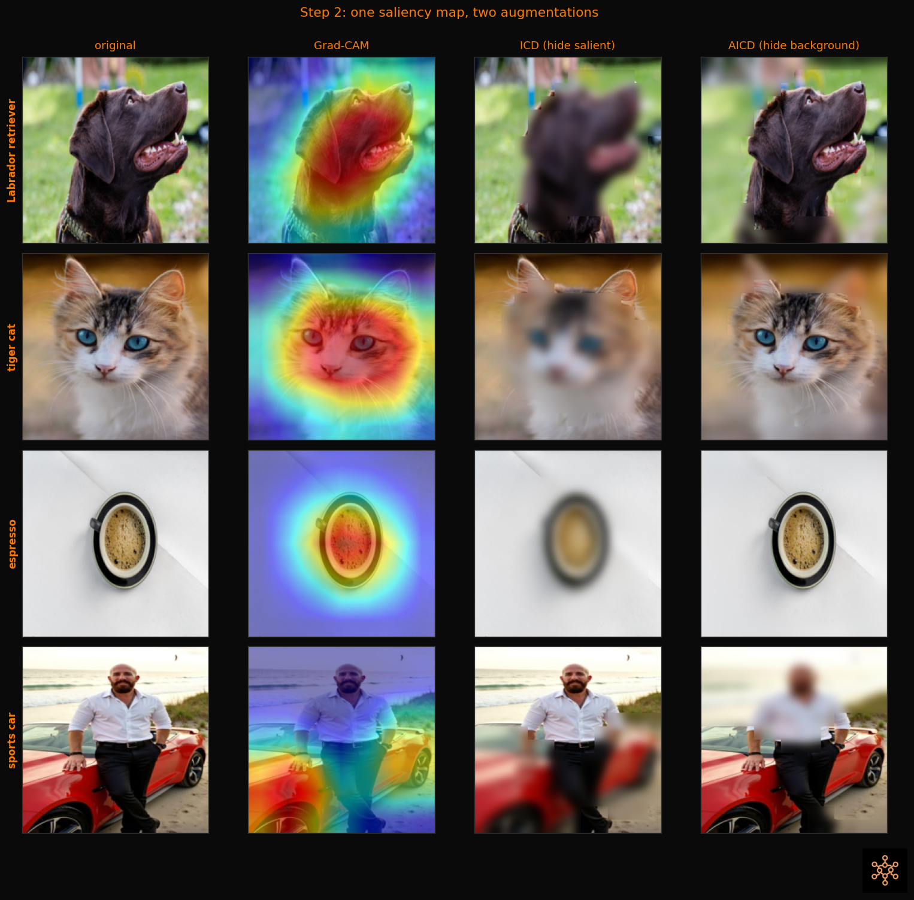
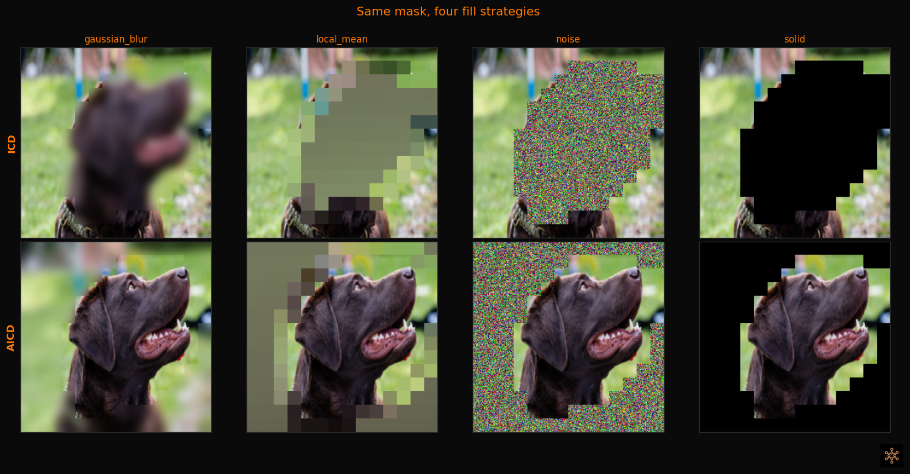

# From Grad-CAM heatmaps to saliency-guided augmentation (BNNR)

[](https://colab.research.google.com/github/bnnr-team/bnnr/blob/main/examples/integrations/gradcam_to_saliency_augmentation.ipynb)

[BNNR](https://github.com/bnnr-team/bnnr) (MIT licensed) uses `grad-cam` as a core dependency for two training-time augmentations called **ICD** and **AICD**. They take a standard Grad-CAM heatmap and turn it into a saliency-aware mask that selectively hides parts of the image during training.

* **ICD (Intelligent Coarse Dropout)** hides the most salient tiles, forcing the model to learn from context and secondary cues instead of one dominant region.
* **AICD (Anti-ICD)** hides the least salient tiles, keeping the important region intact while perturbing the background.

Both support soft fill strategies (blur, local mean, noise) instead of hard black boxes.

The interactive notebook linked above walks through the full path: a familiar `GradCAM(...)` call, then the same saliency reused for ICD and AICD, with side-by-side visualizations and a minimal training loop.

## Side-by-side comparison

The same Grad-CAM heatmap drives both augmentations. ICD blurs out where the model looks; AICD blurs everything else.



## Fill strategies

Hidden tiles can be filled with a blurred copy of the original, local mean color, noise, or a solid value. `gaussian_blur` is a good default.



## Minimal code

```python
from pytorch_grad_cam import GradCAM
from bnnr.icd import ICD
from bnnr.xai_cache import XAICache

# 1. Precompute saliency (one pass over the training set)
cache = XAICache("./xai_cache")
cache.precompute_cache(
    model=model,
    train_loader=train_loader,      # yields (image, label, index)
    target_layers=[model.layer4[-1]],
    n_samples=len(train_dataset),
    method="gradcam",
)

# 2. Create the augmentation
icd = ICD(
    model=model,
    target_layers=[model.layer4[-1]],
    cache=cache,
    explainer="gradcam",
    tile_size=16,
    threshold_percentile=50.0,
    fill_strategy="gaussian_blur",
)

# 3. Apply in the training loop (uint8 HWC input)
augmented = icd.apply_batch_with_labels(images_u8, labels, sample_indices=indices)
```

The dataloader must yield `(image, label, index)` so the cache can key each saliency map to the right sample.

## Links

* **Interactive notebook**: [Open in Colab](https://colab.research.google.com/github/bnnr-team/bnnr/blob/main/examples/integrations/gradcam_to_saliency_augmentation.ipynb) or [view on GitHub](https://github.com/bnnr-team/bnnr/blob/main/examples/integrations/gradcam_to_saliency_augmentation.ipynb)
* **ICD plug-in docs**: [plugin_icd.md](https://github.com/bnnr-team/bnnr/blob/main/docs/plugin_icd.md)
* **Full training loop example**: [icd_plugin_minimal.py](https://github.com/bnnr-team/bnnr/blob/main/examples/classification/icd_plugin_minimal.py)
* **BNNR repo**: [github.com/bnnr-team/bnnr](https://github.com/bnnr-team/bnnr)

## Citation

```bibtex
@software{walo2026bnnr,
  author  = {Walo, Mateusz and Morzhak, Diana and Zydorczyk, Dominika and Saczuk, Zuzanna},
  title   = {{BNNR}: Bulletproof Neural Network Recipe},
  year    = {2026},
  url     = {https://github.com/bnnr-team/bnnr},
  license = {MIT}
}
```
